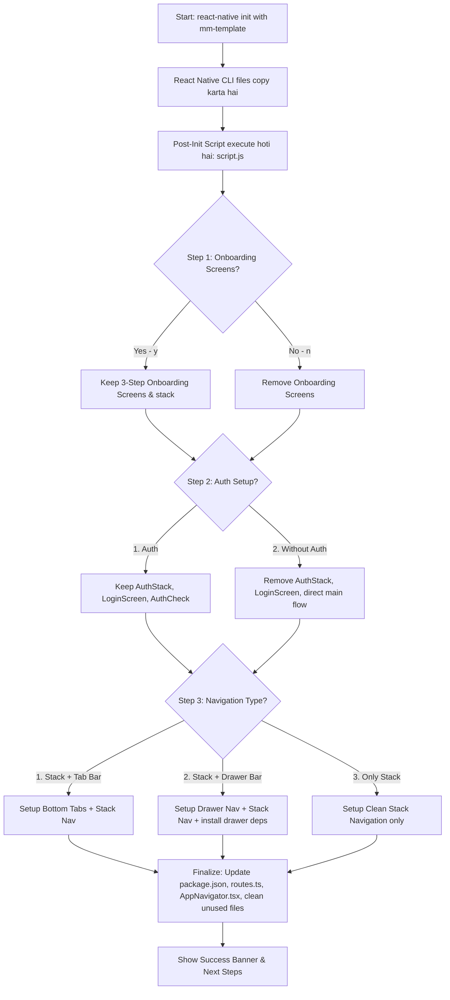

# 🚀 MM Template - Interactive CLI Setup Guide

Yeh document explain karta hai ki **`mm-template`** me interactive setup flow kaise implement kiya ja sakta hai taaki jab bhi koi developer template se project create kare (`npx react-native init MyApp --template @modhamanish/rn-mm-template`), tab terminal par questions puchhe jayein aur unke answers ke hisaab se project structure auto-configure ho jaye.

---

## 📌 1. Requirements & User Flow

Jab user template run karega, toh following questions terminal pe appear honge:



---

## 🏗️ 2. High-Level Architecture: Yeh Kaise Kaam Karta Hai?

React Native Template me **`template.config.js`** file hoti hai:

```javascript
module.exports = {
  placeholderName: "MMTemplate",
  templateDir: "./MMTemplate",
  postInitScript: "./script.js" // 👈 CLI init hone ke baad turant run hota hai
};
```

### Process Lifecycle:
1. **File Extraction**: React Native CLI pehle `MMTemplate` folder ke saare default files copy karta hai.
2. **Post-Init Script Trigger**: React Native CLI `script.js` ko execute karta hai.
3. **Interactive Prompts**: `script.js` terminal me user se input leta hai.
4. **Project Transformation**: User ke answers ke basis pe:
   - Extra screens/navigation files delete hoti hain.
   - Required files (e.g. `DrawerNavigator.tsx` ya `MainTab.tsx`) replace/rename hoti hain.
   - `AppNavigator.tsx` aur `routes.ts` dynamically rewrite/update hote hain.
   - `package.json` me dependencies update hoti hain (agar Drawer chahiye toh `@react-navigation/drawer` add karna, agar Drawer nahi chahiye toh remove karna).
5. **Clean Finish**: Unused boilerplates delete karke final success message show hota hai.

---

## 🛠️ 3. Step-by-Step Implementation Strategy

Interactive CLI banane ke do main approaches hote hain:

### Option A: Clean-up & Dynamic Rewrite Strategy (Recommended & Easiest)
* **Approach**: `MMTemplate` me saare variations ke code pehle se ready rakhein (e.g. `MainTab.tsx`, `MainDrawer.tsx`, `AuthStack.tsx`, `WelcomeScreen.tsx`).
* `script.js` user ke choices ke mutabiq jo nahi chahiye usko `fs.unlinkSync()` se delete kar dega aur `AppNavigator.tsx` ko appropriate template code se overwrite kar dega.

### Option B: Skeleton Snippets Strategy
* Template me alag alag snippets rakhein (e.g., `templates/nav/tab.ts`, `templates/nav/drawer.ts`).
* `script.js` choice ke according final `src/navigation/AppNavigator.tsx` generate karega.

---

## 📋 4. Detailed Options Matrix

| Feature | Option 1 | Option 2 | Option 3 | Files Affected |
| :--- | :--- | :--- | :--- | :--- |
| **Authentication** | **With Auth** (Login, AuthCheck, AuthContext) | **Without Auth** (Direct App Flow) | — | `src/navigation/AuthStack.tsx`, `src/navigation/AuthCheck.tsx`, `src/screens/LoginScreen.tsx`, `src/context/AuthContext.tsx` |
| **Onboarding** | **Yes (y)** (Welcome/Onboarding Flow) | **No (n)** (Skip Onboarding) | — | `src/screens/WelcomeScreen.tsx`, `src/navigation/AppStack.tsx` |
| **Navigation** | **Stack + Bottom Tabs** | **Stack + Drawer Navigation** | **Only Stack Navigation** | `src/navigation/MainTab.tsx`, `src/navigation/MainDrawer.tsx`, `src/navigation/AppStack.tsx`, `package.json` |

---

## 💻 5. Implementation Blueprint for `script.js`

Neeche poora complete code flow blueprint hai jo `script.js` me use kiya ja sakta hai:

### Step 5.1: Interactive CLI Prompt Tool
Terminal par user friendly prompts ke liye hum **Node.js Native `readline`** ya `prompts` use kar sakte hain:

```javascript
const readline = require('readline');
const fs = require('fs');
const path = require('path');

const rl = readline.createInterface({
  input: process.stdin,
  output: process.stdout
});

const askQuestion = (query) => {
  return new Promise((resolve) => rl.question(query, resolve));
};
```

### Step 5.2: Questions Flow Logic

```javascript
async function promptUserConfig() {
  console.log("\n⚙️  Configuring your MM Template App...\n");

  // Question 1: Onboarding Flow
  const onboardingChoice = await askQuestion("📱 Do you need Onboarding screens? (y/n, default y): ");
  const isOnboarding = onboardingChoice.trim().toLowerCase() !== "n";

  // Question 2: Authentication Flow
  console.log("\n🔐 Authentication Setup:");
  console.log("  [1] With Auth (Login, AuthCheck & Protected routes)");
  console.log("  [2] Without Auth (Direct Home flow)");
  const authChoice = await askQuestion("Select Auth option (1 or 2, default 1): ");
  const isAuth = authChoice.trim() !== "2";

  // Question 3: Navigation Flow
  console.log("\n🧭 Navigation Type:");
  console.log("  [1] Stack Navigation + Bottom Tab Bar");
  console.log("  [2] Stack Navigation + Drawer Bar");
  console.log("  [3] Only Stack Navigation");
  const navChoice = await askQuestion("Select Navigation type (1, 2, or 3, default 1): ");
  const navType = navChoice.trim() === "2" ? "drawer" : navChoice.trim() === "3" ? "stack" : "tab";

  rl.close();

  return { isAuth, isOnboarding, navType };
}
```

---

## 🗂️ 6. File System Transformations & Actions

User ke input lene ke baad `script.js` file adjustments karega:

### 1. Handling Auth:
* **Agar Without Auth (Option 2) select kiya:**
  * Delete: `src/navigation/AuthStack.tsx`
  * Delete: `src/navigation/AuthCheck.tsx`
  * Delete: `src/screens/LoginScreen.tsx`
  * Update `AppNavigator.tsx`: AuthCheck aur AuthStack wrapper hata kar seedha AppStack render karein.

### 2. Handling Onboarding:
* **Agar Without Onboarding (n) select kiya:**
  * Delete: `src/screens/WelcomeScreen.tsx`
  * Remove `WelcomeScreen` route from `routes.ts` & `AppStack.tsx`.

### 3. Handling Navigation:
* **Option 1 (Stack + Bottom Tab):**
  * Keep: `src/navigation/MainTab.tsx`
  * Delete: `src/navigation/MainDrawer.tsx` (agar present hai)
* **Option 2 (Stack + Drawer):**
  * Keep: `src/navigation/MainDrawer.tsx`
  * Delete: `src/navigation/MainTab.tsx`
  * Add `@react-navigation/drawer` & `react-native-gesture-handler` to `package.json`
* **Option 3 (Only Stack):**
  * Delete: `src/navigation/MainTab.tsx`
  * Delete: `src/navigation/MainDrawer.tsx`
  * `AppStack.tsx` me directly `HomeScreen` ko initial route banayein.

---

## 📦 7. Updating `package.json` Dynamically

Agar user ne **Drawer Navigation** choose kiya, ya **Tab Navigation** remove kiya, toh dependencies update karne ka function:

```javascript
function updatePackageJson(projectRoot, { navType }) {
  const pkgPath = path.join(projectRoot, 'package.json');
  if (!fs.existsSync(pkgPath)) return;

  const pkg = JSON.parse(fs.readFileSync(pkgPath, 'utf8'));

  if (navType === 'drawer') {
    // Add Drawer dependencies
    pkg.dependencies = pkg.dependencies || {};
    pkg.dependencies["@react-navigation/drawer"] = "^7.0.0";
    pkg.dependencies["react-native-gesture-handler"] = "^3.2.1";
    pkg.dependencies["react-native-reanimated"] = "^3.16.0";
    
    // Remove Bottom Tabs if not needed
    delete pkg.dependencies["@react-navigation/bottom-tabs"];
  } else if (navType === 'stack') {
    // Remove Bottom tabs & Drawer dependencies
    delete pkg.dependencies["@react-navigation/bottom-tabs"];
    delete pkg.dependencies["@react-navigation/drawer"];
  }

  fs.writeFileSync(pkgPath, JSON.stringify(pkg, null, 2), 'utf8');
}
```

---

## 🧪 8. Local Testing Flow (Bina Publish Kiye Test Kaise Karein)

Jab aap is flow ko implement karenge, toh test karne ke liye ye steps follow karein:

1. **Local Template Test Command**:
   ```bash
   npx react-native init TestApp --template file:///Users/jayp/Desktop/rn/mm-template
   ```
2. Terminal pe interactive questions appear honge.
3. Test combinations:
   * **Test 1**: Auth (1) + Onboarding (y) + Tab Bar (1)
   * **Test 2**: Without Auth (2) + No Onboarding (n) + Drawer (2)
   * **Test 3**: Without Auth (2) + Onboarding (y) + Only Stack (3)
4. Check karein ki `TestApp` me wahi files bachi hain jo select hui thin, aur `yarn ios` / `yarn android` successfully run ho raha hai.

---

## 🎯 9. Next Steps Summary Checklist

Jab aap implement karne ke liye ready honge:
- [ ] `MMTemplate/src/navigation/` me `MainDrawer.tsx` component add karein.
- [ ] `AppNavigator.tsx` aur `AppStack.tsx` ke template variations tayyar karein.
- [ ] `script.js` me interactive prompt logic aur file modification logic add karein.
- [ ] Local environment me `npx react-native init` command ke sath test karein.
- [ ] `release.js` run karke npm par new version release karein.
